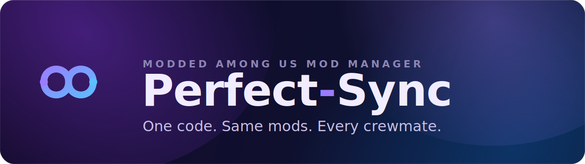

<div align="center">



<br>

[](#install-and-run)
[](https://github.com/artriy/Perfect-Sync/releases)
[](https://tauri.app)
[](LICENSE)

**A desktop mod manager and launcher for modded Among Us.** It installs BepInEx for you,
keeps your mods in named profiles, and turns a lobby's exact mod set into a short code your
friends can paste to match you, same mods, same versions, one launch.

</div>

> [!NOTE]
> **Disclaimer.** Perfect-Sync is an unofficial, fan-made tool. It is not affiliated with,
> endorsed by, or sponsored by Innersloth LLC. Among Us is a trademark of Innersloth LLC.
> Use modded clients only in private and modded lobbies. Do not use mods to disrupt public
> or vanilla games. See the [Among Us mod policy](https://www.innersloth.com/among-us-mod-policy/).


## Features

<table>
  <tr>
    <td align="center" width="33%" valign="top">
      <br>
      <b>One-click BepInEx</b><br>
      <sub>Installs the mod loader into your game folder, then self-heals and updates it after game patches.</sub>
    </td>
    <td align="center" width="33%" valign="top">
      <br>
      <b>Mod profiles</b><br>
      <sub>Keep multiple named mod sets, toggle mods, swap versions, and resume the last one you used.</sub>
    </td>
    <td align="center" width="33%" valign="top">
      <br>
      <b>Lobby codes</b><br>
      <sub>Export a profile as a short PERFECT- code. Friends paste it and get the exact same mods.</sub>
    </td>
  </tr>
  <tr>
    <td align="center" width="33%" valign="top">
      <br>
      <b>Trust tiers</b><br>
      <sub>Every mod is labeled Trusted, Community, or Flagged, so you know how vetted it is before it installs.</sub>
    </td>
    <td align="center" width="33%" valign="top">
      <br>
      <b>Catalog and any repo</b><br>
      <sub>Add popular mods from the built-in catalog, or paste any GitHub repo and pick the exact release.</sub>
    </td>
    <td align="center" width="33%" valign="top">
      <br>
      <b>Launch via Steam or Epic</b><br>
      <sub>Syncs your profile, verifies BepInEx, and starts the modded game through the right store.</sub>
    </td>
  </tr>
</table>

Plus architecture auto-detect (x86 or x64 chosen from the real game executable) and personal
always-include mods that get merged into every lobby code you apply.


## How it works

1. **Set up.** On first run the wizard auto-detects your Steam or Epic install, or you browse to
   the folder, then offers a one-time BepInEx install (about 30 MB).
2. **Add mods.** Browse the built-in catalog or paste a GitHub repo URL into the active profile.
3. **Pick a version.** A release picker lists recent releases so you choose the exact asset; the
   app downloads it and installs the DLL.
4. **Manage.** Toggle mods on and off, change versions, and create or switch named profiles.
5. **Share or apply.** Export a profile as a `PERFECT-` code, or paste a friend's code to preview
   a per-mod diff with trust badges, then apply it.
6. **Launch.** Click Launch to sync, verify BepInEx, and start via Steam or Epic. Or use Set up
   mods to sync without launching.


## Mod trust levels

| Tier | Meaning |
| --- | --- |
| **Trusted** | Curated, known-good mods from the catalog. |
| **Community** | Listed in the catalog, but not first-party curated. |
| **Flagged / Unverified** | Anything off-catalog. Install at your own risk. |

## Install and run

Windows is the supported platform.

1. Download the installer (`Perfect-Sync_<version>_x64-setup.exe`) or the portable `app.exe`
   from [Releases](https://github.com/artriy/Perfect-Sync/releases).
2. The build is unsigned, so Windows SmartScreen shows a warning on first run. Click
   **More info**, then **Run anyway**.

## Build from source

See [BUILD.md](BUILD.md). In short:

```sh
pnpm install
pnpm run build:exe
```

Stack: Tauri 2, React 19, TypeScript, Vite, Tailwind v4, with a Rust core crate.

## Platform support

Windows is supported and tested. Linux (via Steam Proton) and macOS (via Wine and CrossOver)
exist in the code but are experimental and have not been built or tested on those platforms.

## Security note

Applying a lobby code installs the mod DLLs that the code lists, and mods run as native code
inside the game. Downloads come over HTTPS from their sources but are not signature-verified,
so only add repos and apply codes from people you trust. Trusted and Community mods are vetted;
Flagged mods are not.

## Credits

Built on [BepInEx](https://github.com/BepInEx/BepInEx). Type set in
[Outfit](https://github.com/Outfitio/Outfit-Fonts) and
[JetBrains Mono](https://github.com/JetBrains/JetBrainsMono). Mods are created by their
respective authors and downloaded at runtime under their own licenses. Full third-party
notices are in [NOTICE](NOTICE).

## License

Released under the [MIT License](LICENSE).
