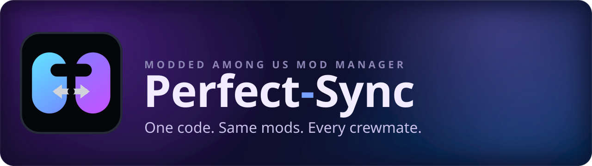

<div align="center">



<br>

[](#platform-support)
[](https://github.com/artriy/Perfect-Sync/releases)
[](https://tauri.app)
[](LICENSE)

**An experimental desktop mod manager and launcher for modded Among Us.** It installs
BepInEx, keeps Perfect-Sync-managed mods in named profiles, and lets friends preview
and apply a shared lobby mod set.

</div>

> [!NOTE]
> **Disclaimer.** Perfect-Sync is an unofficial, fan-made tool. It is not affiliated with,
> endorsed by, or sponsored by Innersloth LLC. Among Us is a trademark of Innersloth LLC.
> Use modded clients only in private and modded lobbies. Do not use mods to disrupt public
> or vanilla games. See the [Among Us mod policy](https://www.innersloth.com/among-us-mod-policy/).


## Features

<table>
  <tr>
    <td align="center" width="33%" valign="top">
      <br>
      <b>One-click BepInEx</b><br>
      <sub>Installs and verifies the mod loader in a writable game copy, with rollback-safe replacement.</sub>
    </td>
    <td align="center" width="33%" valign="top">
      <br>
      <b>Mod profiles</b><br>
      <sub>Keep multiple named mod sets, toggle mods, swap versions, and resume the last one you used.</sub>
    </td>
    <td align="center" width="33%" valign="top">
      <br>
      <b>Lobby codes</b><br>
      <sub>Export a profile as a short PERFECT- code. Friends preview its requested mod set before applying it.</sub>
    </td>
  </tr>
  <tr>
    <td align="center" width="33%" valign="top">
      <br>
      <b>Trust tiers</b><br>
      <sub>Distinguishes curated catalog metadata, community listings, and unknown sources before installation.</sub>
    </td>
    <td align="center" width="33%" valign="top">
      <br>
      <b>Catalog and any repo</b><br>
      <sub>Add popular mods from the built-in catalog, or paste any GitHub repo and pick the exact release.</sub>
    </td>
    <td align="center" width="33%" valign="top">
      <br>
      <b>One-click launch</b><br>
      <sub>Publishes the selected managed profile, verifies BepInEx, and starts the modded game in a single click.</sub>
    </td>
  </tr>
</table>

Plus architecture detection (x86 or x64 from the game executable), a global list of
named Among Us instances with one assigned independently to each profile, and persistent
personal GitHub or local-DLL defaults merged into every applied lobby profile. Local DLLs
remain device-only and are never serialized into lobby codes.

> [!TIP]
> **The app-data profile is the source of truth for Perfect-Sync-managed plugin DLLs.**
> At setup or launch, Perfect-Sync publishes that profile into the writable game copy.
> It deliberately replaces or removes DLLs recorded as Perfect-Sync-owned when the
> profile changes. DLLs it does not own are preserved, and a managed DLL is not allowed
> to overwrite an unmanaged file with the same name. Microsoft Store / Game Pass installs
> in the protected `WindowsApps` tree use Settings' managed-copy flow to create a normal,
> writable x64 game copy before setup or launch.


## How it works

1. **Set up.** On first run the wizard detects supported Steam, Epic, Microsoft Store,
   or Game Pass locations, or you select a folder containing `Among Us.exe`. Add and
   name other game copies later in Settings. Protected Store installations can be copied
   transactionally into a writable managed location from the same screen.
2. **Add mods.** Browse the catalog or enter an exact HTTPS GitHub repository URL.
3. **Pick a version.** Choose a release asset. Unknown repositories and assets require
   an explicit confirmation before native code is installed.
4. **Manage.** Toggle mods, change versions, create or switch profiles, and assign a
   game instance to each profile. The profile and its managed DLLs live under the
   host's application-data directory, not in the selected game folder.
5. **Share or apply.** Export a `PERFECT-` code containing every enabled shareable
   mod's exact repository identity, release version, selected asset, and the exact
   LevelImposter map IDs. Preview the resulting per-mod changes and trust classification
   before applying it. Local DLLs and game-build restrictions remain device-local.
   Unknown lobby repositories still require explicit confirmation.
6. **Launch.** Perfect-Sync reconciles dependencies, transactionally publishes the
   profile's owned DLLs, verifies BepInEx, and starts the Windows game. On Linux and
   macOS the native Perfect-Sync app launches the Windows game through a configured
   supported compatibility runtime. **Set up mods** performs publication without launch.


## Mod source classifications

| Tier | Meaning |
| --- | --- |
| **Trusted** | Metadata curated in Perfect-Sync's trusted catalog. This is not a publisher signature or a verification of the downloaded native code. |
| **Community** | Catalog-listed metadata that is not in the curated trusted tier. |
| **Flagged / Unverified** | An unknown direct repository, asset, or lobby mod. Explicit confirmation is required; install only if you trust the source. |

## Install and run

Download the bundle for your host from
[Releases](https://github.com/artriy/Perfect-Sync/releases). The release page is also
where the in-app update notification sends you: v0.1.0 does not download or install
application updates automatically.

| Perfect-Sync host | Package and first-run restriction |
| --- | --- |
| Windows 10/11 x64 | Windows installer; unsigned, so SmartScreen can require **More info → Run anyway**. |
| Linux x86_64 | Native Linux bundle; the Windows game still runs through a supported Proton, Wine, or Bottles setup. |
| macOS Apple Silicon | Native `aarch64` bundle; ad-hoc signed but not Apple-notarized, so Gatekeeper can block the download. |
| macOS Intel | Native `x64` bundle; ad-hoc signed but not Apple-notarized, so Gatekeeper can block the download. |

On macOS, drag the app to Applications. Ad-hoc signing checks bundle consistency but
does not establish a trusted developer identity. If you trust the download and
Gatekeeper quarantines it, you may remove that quarantine:

```sh
xattr -dr com.apple.quarantine "/Applications/Perfect-Sync.app"
```

Running the Windows `app.exe` itself under Wine/Proton is not supported; use the native
Perfect-Sync build for the host.

## Build from source

See [BUILD.md](BUILD.md). The Windows NSIS quick path is:

```sh
pnpm install --frozen-lockfile
pnpm run build:exe
```

Linux and macOS use the target-specific `pnpm tauri build --target ...` commands in
the build guide.

Stack: Tauri 2, React 19, TypeScript, Vite, Tailwind v4, with a Rust core crate.

## Platform support

| Perfect-Sync host | Windows Among Us runtime | Status |
| --- | --- | --- |
| Windows 10/11 x64 | Native Steam, Epic, or writable manual copy | **Primary supported target** |
| Windows 10/11 x64 | Microsoft Store / Game Pass | Protected native folder is not writable; copy the game to a normal folder and select that copy |
| Linux x86_64 / Steam Deck | Steam/Flatpak Steam + Proton, Wine, or Bottles | **Experimental**; native app build and CI coverage exist, but each real host/runtime/store combination still needs validation |
| macOS Intel or Apple Silicon | CrossOver, Whisky, or Wine | **Experimental**; native app build and CI coverage exist, but each real host/runtime/store combination still needs validation |
| Windows Perfect-Sync executable under Wine/Proton | Any | **Unsupported** — use the native host build |
| Android, iOS, BSD, ChromeOS, Linux ARM64, Windows ARM64 | Any | **Unsupported** |

Release CI builds Windows x64, Linux x86_64, macOS Intel, and macOS Apple Silicon
packages and runs the locked workspace tests on every build host before bundling.
Its filesystem/runtime tests and bundle checks validate build portability, host-gated
behavior, command construction, and package structure only. They do **not** establish
that a package launches and modifies the game correctly on real hardware, under a
particular store client, or through every compatibility frontend.

## Security and ownership

Mods are native code loaded inside the game. Perfect-Sync requires HTTPS. Within one
install operation it checks the downloaded asset against the size and any SHA-256
digest supplied by the release metadata fetched for that operation, and ZIP extraction
enforces strict entry, path, per-file, and expanded-size limits. These controls detect
corruption, truncated/replaced assets, path traversal, and some metadata/asset
time-of-check/time-of-use races. They are **integrity checks, not authenticity**:
metadata and downloads are not publisher-signed, and a compromised source can replace
both. Only the **Trusted** catalog metadata tier is curated. Unknown direct
repositories/assets and lobby mods require explicit confirmation; trust the source and
the person sharing a lobby code.

The Epic launch helper is a special case: Perfect-Sync pins the HTTPS archive's size and
SHA-256, requires an exact one-file ZIP shape, and verifies the extracted executable's
size and SHA-256 before publishing or reusing it.

An optional GitHub token is stored in the host OS credential service (Windows
Credential Manager, macOS Keychain, or Linux Secret Service), sent only to allowlisted
GitHub HTTPS hosts, and never returned to the frontend. A legacy token found in
`settings.json` is migrated to the OS keyring and scrubbed from the settings file.

During synchronization, an ownership marker limits replacement/removal to
Perfect-Sync-managed plugin DLLs. Unmanaged files in `BepInEx/plugins` are preserved;
name collisions fail instead of overwriting them. Replacement of previously owned DLLs
is deliberate when changing profiles or versions.

## Credits

Built on [BepInEx](https://github.com/BepInEx/BepInEx). Type set in
[Outfit](https://github.com/Outfitio/Outfit-Fonts) and
[JetBrains Mono](https://github.com/JetBrains/JetBrainsMono). Mods are created by their
respective authors and downloaded at runtime under their own licenses. Full third-party
notices are in [NOTICE](NOTICE).

## License

Released under the [MIT License](LICENSE).
